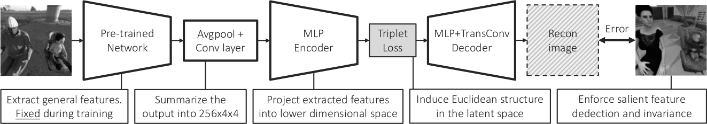

# Autoencoder for Synthetic to Real Generalization: From Simple to More Complex Scenes

This repository is the official PyTorch implementation of [Autoencoder for Synthetic to Real Generalization: From Simple to More Complex Scenes](https://sviro.kl.dfki.de/). 




If you want to cite our work, please use the following bibtex entry:

```
@INPROCEEDINGS{DiasDaCruz2022Syn2real,
  author = {Steve {Dias Da Cruz} and Bertram Taetz and Thomas Stifter and Didier Stricker},
  title = {Autoencoder for Synthetic to Real Generalization: From Simple to More Complex Scenes},
  booktitle = {Proceedings of the IEEE International Conference on Pattern Recognition (ICPR)},
  year = {2022}
} 
```

## Requirements

To install requirements:

```setup
pip3 install -r requirements.txt
```

If you want to plot the t-SNE projection of the latent space, then you will need to use additionally anaconda and install `cuml` (which provides, among other things, GPU accelerated t-SNE projection).
One could use, for example, the following command, but please check their [website](https://rapids.ai/start.html) to make sure to install the correct version for your needs.

```setup
conda create -n rapids-0.19 -c rapidsai -c nvidia -c conda-forge cuml=0.19 python=3.8 cudatoolkit=11.0
```

## Downloads

The datasets need to be downloaded manually from the following locations:

| Dataset                       | Website                                                                              | License         |
| ------------------------------|--------------------------------------------------------------------------------------|-----------------| 
| SVIRO-NoCar                   | https://sviro.kl.dfki.de/                                                            | CC BY-NC-SA 4.0 |
| SVIRO                         | https://sviro.kl.dfki.de/                                                            | CC BY-NC-SA 4.0 |
| SVIRO-Illumination            | https://sviro.kl.dfki.de/                                                            | CC BY-NC-SA 4.0 |
| TICaM                         | https://vizta-tof.kl.dfki.de/                                                        | CC BY-NC-SA 4.0 |
| MPI3D                         | https://github.com/rr-learning/disentanglement_dataset                               | CC BY 4.0       |

Place the datasets inside a folder of your choice. Then define the root path to all the datasets inside `dataset.py`:
```
ROOT_DATA_DIR = Path("")
```
Potentially, you need to adapt the folder name of the downloaded datasets to match the names used inside `dataset.py` (i.e. the names from the table above).
When you run a training script for a dataset for the first time, then the script will perform a pre-processing to center crop and resize the images to 128 pixels and save them alongside the original images.

## Training

The hyperparameters for the different training approaches for the different models are defined in config files located in the cfg folder.
Modify the hyperparameters accordingly to which approach you want to use during training. 
Then, inside `train_ae.py`, `repeat_train_ae.py`,  `train_classifier.py` or `repeat_train_classifier.py` modify which config file to load, e.g.:
```
config = toml.load("cfg/extractor_ae.toml")
```
Finally, to train the model using the defined config file, run one of those commands:

```
python3 train_ae.py
```
```
python3 train_classifier.py
```
```
python3 repeat_train_ae.py
```
```
python3 repeat_train_classifier.py
```

`repeat_train_ae.py` and `repeat_train_classifier.py` will repeat the same experiment using the same hyperparameters for the different seeds defined inside the files respectively.
The config files are self-explanatory and provide the necessary information to reproduce the results of our paper. We provide config files for the most important experiments in the config folder.

## Evaluation

Evaluation needs to be performed by chaining a few scripts after another.
All the experiments, which you want to evaluate, need to be located inside the results folder.

If you want to evaluate your model on all (or a subset of all) datasets, you can use `eval_ae.py` or `eval_classifier.py`, depending on whether you want to evaluate an autoencoder approach or a classifier.
In either case, the accuracy will be saved inside the experiment folder, such that you can use it later using `calculate_mean_and_var_accuracy.py`.
Put the experiment folder names inside the script and run

```
python3 eval_ae.py
```
```
python3 eval_classifier.py
```

You can then use `calculate_mean_and_var_accuracy.py` to compute the mean, standard deviation and max performance on all datasets.
Again, you need to specify inside the scripts which experiments to consider and run

```
python3 calculate_mean_and_var_accuracy.py
```

If you just want to plot the training performance distribution on TICaM for each checkpoint across several runs, you can use `plot_accuracy_over_time.py`.
In that case, you only need to group and specify the experiments together which should be used to compute the average performance and run

```
python3 plot_accuracy_over_time.py
```

If you want to reconstruct examples on different datasets and/or extract and save the latent space for visualization, then you can use `recon_and_save_latent_space.py`.
The latent space and reconstructions will be saved inside the experiment folder. As previously, specify the experiments to consider and simply call
```
python3 recon_and_save_latent_space.py 
```

The extracted latent space can then be plotted using `plot_extracted_and_saved_latent_space.py`. You will have to use conda and cuml to plot this script.
Specify the directory of the experiment to consider inside the script and run
```
python3 plot_extracted_and_saved_latent_space.py 
```

If you want to measure the reconstruction quality on the MPI3D dataset, you can simply use the `compute_mpi3d_score.py` scripts.
You only need to specify the experiments inside the script and select which norm you want to use to make the comparison.
```
python3 compute_mpi3d_score.py 
```

## Results - Classification accuracies from paper

Mean accuracy of the different methods as reported in the paper. For more detailed results (standard deviation and maximum) please consult our paper. 
We also provide the pre-trained weights of the models used for the paper results, i.e. the 10 experiments for different seeds for all model variations, as well as the corresponding log and config files.
Due to Google Drive space limitation, we were not able to upload the results for the VGG-11 classifier being fine-tuned or trained from scratch.
The two currently missing results will be made publicly available in case the paper gets accepted.


| Model              | Variant         | TICaM            | SVIRO           | SVIRO-Illumination | Download link                                                                              |
| ------------------ |---------------- | ---------------- |---------------- |------------------- |------------------------------------------------------------------------------------------- |
| Resnet-50          | Scratch         | 53.3%            | 56.4%           | 65.2%              | [link](https://sviro.kl.dfki.de/download/classifier-scratch-resnet-50/?wpdmdl=2002&refresh=624300572a1361648558167) |
| Densenet-121       | Scratch         | 56.3%            | 68.8%           | 77.5%              | [link](https://sviro.kl.dfki.de/download/classifier-scratch-densenet-121/?wpdmdl=2001&refresh=62430032399cf1648558130) |
| Resnet-50          | Pre-trained     | 78.1%            | 83.5%           | 95.0%              | [link](https://sviro.kl.dfki.de/download/classifier-pre-trained-resnet-50/?wpdmdl=2000&refresh=6243001102e931648558097) |
| Densenet-121       | Pre-trained     | 72.2%            | 85.0%           | 94.8%              | [link](https://sviro.kl.dfki.de/download/classifier-pre-trained-densenet-121/?wpdmdl=1999&refresh=6242ffed6e2b81648558061) |
| VGG-11             | E-TAE           | 76.7%            | 78.6%           | 79.6%              | [link](https://sviro.kl.dfki.de/download/e-tae-vgg-11/?wpdmdl=1992&refresh=6242fe26c85a21648557606) |
| Resnet-50          | E-TAE           | 83.8%            | 85.8%           | 94.5%              | [link](https://sviro.kl.dfki.de/download/e-tae-resnet-50/?wpdmdl=1991&refresh=6242fdf8db1351648557560) |
| Densenet-121       | E-TAE           | 78.5%            | 86.7%           | 95.5%              | [link](https://sviro.kl.dfki.de/download/e-tae-densenet-121/?wpdmdl=1990&refresh=6242fce26d2ce1648557282) |
| VGG-11             | I-E-TAE         | 79.7%            | 80.9%           | 79.6%              | [link](https://sviro.kl.dfki.de/download/i-e-tae-vgg-11/?wpdmdl=1995&refresh=6242feb56277f1648557749) |
| Resnet-50          | I-E-TAE         | 83.5%            | 89.2%           | 95.3%              | [link](https://sviro.kl.dfki.de/download/i-e-tae-resnet-50/?wpdmdl=1994&refresh=6242fe7c3eac61648557692) |
| Densenet-121       | I-E-TAE         | 77.2%            | 90.4%           | 96.7%              | [link](https://sviro.kl.dfki.de/download/i-e-tae-densenet-121/?wpdmdl=1993&refresh=6242fe53b54a71648557651) |
| VGG-11             | II-E-TAE        | 81.0%            | 79.1%           | 78.9%              | [link](https://sviro.kl.dfki.de/download/ii-e-tae-vgg-11/?wpdmdl=1998&refresh=6242ff8e6e1491648557966) |
| Resnet-50          | II-E-TAE        | 83.7%            | 93.0%           | 95.1%              | [link](https://sviro.kl.dfki.de/download/ii-e-tae-resnet-50/?wpdmdl=1997&refresh=6242ff6ade4d21648557930) |
| Densenet-121       | II-E-TAE        | 79.3%            | 89.9%           | 95.0%              | [link](https://sviro.kl.dfki.de/download/ii-e-tae-densenet-121/?wpdmdl=1996&refresh=6242ff43325e91648557891) |

## Results - Reconstructions from paper

Further, we provide also pre-trained weights when trained on other datasets, which are used for the reconstruction visualizations only in our paper.

| Variant                      | Training dataset             | Download link                                                                              |
|----------------------------- | -----------------------------| ------------------------------------------------------------------------------------------ |
| AE, E-AE, VAE, $\beta$-VAE and FactorVAE               | MPI3D                        | [link](https://sviro.kl.dfki.de/download/mpi3d/?wpdmdl=2003&refresh=6243007f931491648558207) |
| E-AE, I-AE                   | SVIRO and SVIRO-Illumination | [link](https://sviro.kl.dfki.de/download/sviro/?wpdmdl=2004&refresh=624300a4204131648558244) |


## Miscellaneous

Regarding the remaining scripts inside this repository, we provide some small explanations:

| Script                        | Training dataset                                                                              | 
|------------------------------ | ----------------------------------------------------------------------------------------------| 
| compute_complexity_dataset.py | Used to calculate Shannon entropy and mean gray level co-occurence matrix for MPI3D and TICaM | 
| model.py                      | Autoencoder model architecture definitions                                                    | 
| pretrained_model.py           | Classification model architecture definitions                                                  | 
| dataset.py                    | Dataloader for the different datasets                                                         | 
| utils.py                      | A few helperfunctions                                                                         | 

## Contributing

All contributions welcome! All content in this repository is licensed under the MIT license.

## Acknowledgment

Steve Dias Da Cruz and the work presented in this repository were supported by the Luxembourg National Research Fund (FNR) under grant number 13043281. This work was partially funded by the Luxembourg Ministry of the Economy (CVN 18/18/RED).
